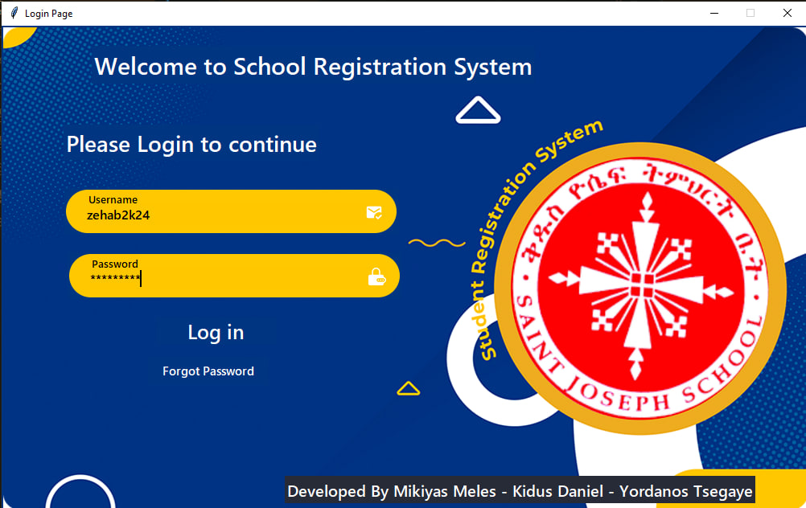
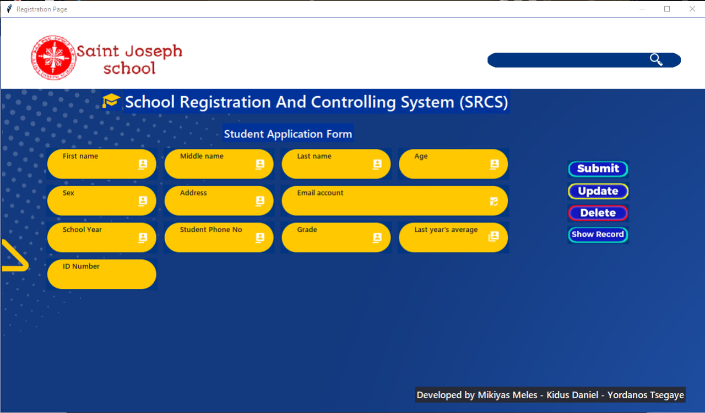
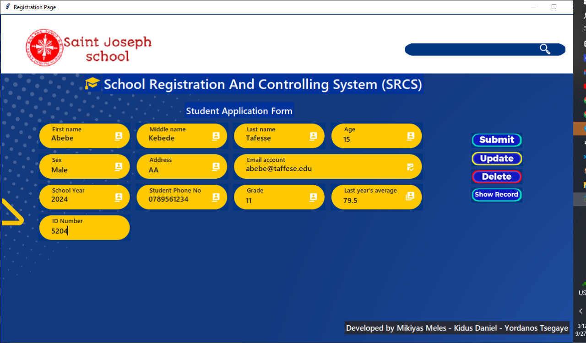
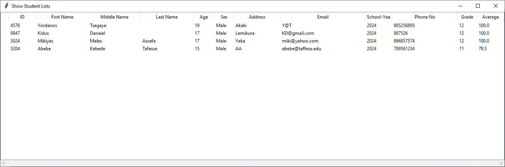
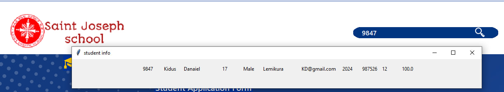

# student-registration-system-for-schools

student-registration-system-for-schools is a student application form designed to manage student registration data efficiently. 
This application is built using Python and the Tkinter library for the user interface.

## Table of Contents
- [About](#about)
- [Screenshots](#screenshots)
- [Features](#features)
- [Installation](#installation)
- [Usage](#usage)
- [License](#license)
- [Acknowledgments](#acknowledgments)
- [Contact](#contact)

## About

SRS is a user-friendly application that allows you to record and manage student registration data. It provides 
an intuitive graphical interface for adding, editing, and searching for student records. 
SRS is particularly useful for schools and educational institutions to streamline their student data management.

## Screenshots

## Features

- Add new student records with detailed information.
- Edit and update existing student records.
- Search for student records by ID.
- View a list of all student records.
- User-friendly graphical interface.

## Installation

To run SRS on your local machine, follow these steps:

1. Clone the repository to your local machine:
git clone https://github.com/Mikiyas-Meles-Assefa/student-registration-system-for-schools.git

2. Navigate to the project directory:

3. Run the application:

Make sure you have Python installed on your system.

## Usage

- Launch the application using the provided installation instructions.
- Add new student records by entering their information.
- Edit and update student records as needed.
- Search for student records by ID to view their details.
- View a list of all student records.

## License

This project is licensed under the MIT License - see the [LICENSE](LICENSE) file for details.

## Acknowledgments

This project was developed using the Python Tkinter library.

## Contact

For any inquiries or suggestions, please contact:

- Mikiyas Meles Assefa
- Email: mikiyasmeles.302419.cs@gmail.com
- GitHub: [Mikiyas-Meles-Assefa](https://github.com/Mikiyas-Meles-Assefa)

